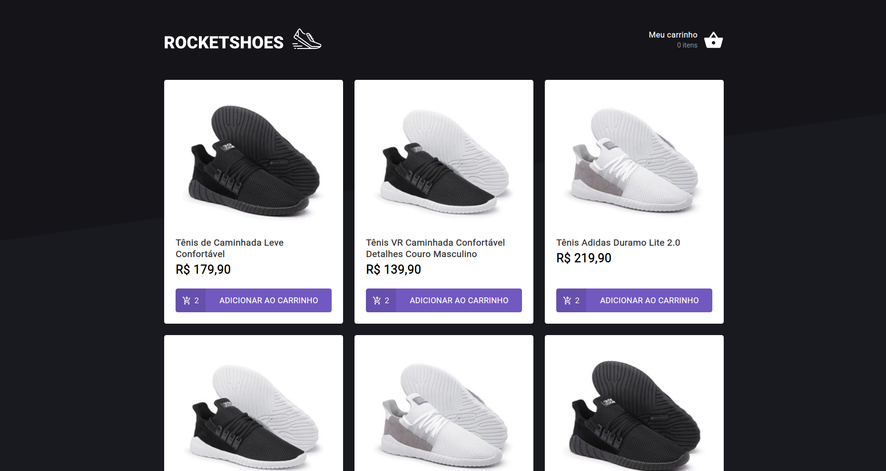

# Rocket Seat Ignite - RocketShoes

<!-- <p align="center">
  
</p> -->

## Table of Contents

- [About](#about)
- [Getting Started](#getting_started)
- [Usage](#usage)
- [Docs](#docs)
- [Resources](#resources)

## About <a name = "about"></a>

A basic shoe Ecommerce UI wih React Hooks.

## Getting Started <a name = "getting_started"></a>

### Prerequisites

- `node >= 12.0.0`

### Installation

1. Clone this repo locally and install the required packages:

```bash
$ git clone https://github.com/librity/ignite_shoes.git
$ cd ignite_shoes
$ yarn install
```

2. Start a json server (mock backend):

```bash
$ yarn server
```

3. Start a dev server:

```bash
$ yarn start
```

4. Open http://localhost:3000 your web browser.

### Testing

Run tests with jest:

```bash
$ yarn test
```

## Usage <a name = "usage"></a>

Click on an Item to add it to your cart.
You can also edit the quantity and remove items from your cart.

## Docs <a name = "docs"></a>

- https://github.com/typicode/json-server
- https://github.com/fkhadra/react-toastify

## Resources <a name = "resources"></a>

- https://www.tutorialspoint.com/typescript/typescript_interfaces.htm
